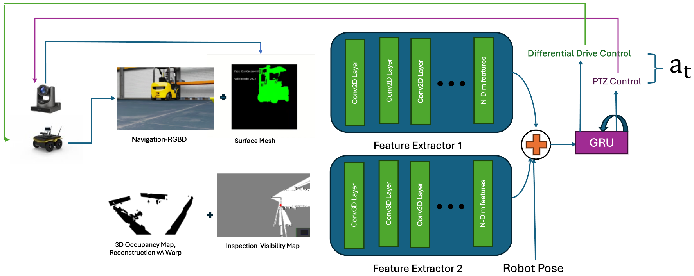

# Learning Robot Exploration and Inspection Policies to Directly Optimize Fidelity of 3D Gaussian Splatting Reconstruction ( Ongoing Work)

## Note
Switched to this feature branch to support multi env training due to Ray Caster Camera

# Running program

All the environment source code and configurations are located in the [Robot Inspection env](source/isaaclab_tasks/isaaclab_tasks/direct/robot_inspection) directory. To run the Environment without training, use the following command:

```bash
python3 scripts/environments/inspection_agent_discrete.py
rm -rf ~/.local/share/ov/data/Kit/Isaac-Sim/5.0
rm -rf ~/.cache/ov/Kit/Isaac-Sim/5.0
rm -rf ~/.nvidia-omniverse/logs/Kit/Isaac-Sim/5.0
export VK_ICD_FILENAMES=/usr/share/vulkan/icd.d/nvidia_icd.json
```

## Note 
You need to follow the usual setup instructions for Isaac Lab.

# Important Details and Implementation Notes

## Neural Network Architecture

Using the architecture from image example above.

- 2d (128, 128, 6) Image 

## Reward Design
The reward is designed to directly optimize the fidelity of the 3D Gaussian Splatting reconstruction.

But first we need to prettrain to perform inpection coverage of tragrt object.

Reward Components:
1. **Inspection Coverage**: This reward encourages the agent to cover as much of the target object as possible. It can be calculated based on the number of unique face MESH obtained at time t.
2. **Exploration Reward**: We reward information gain from exploring the areas.
3. **Visibility Reward**: This reward ecnourages exploring the environment  with inspection camera to keep the target object in view and find the target object.
